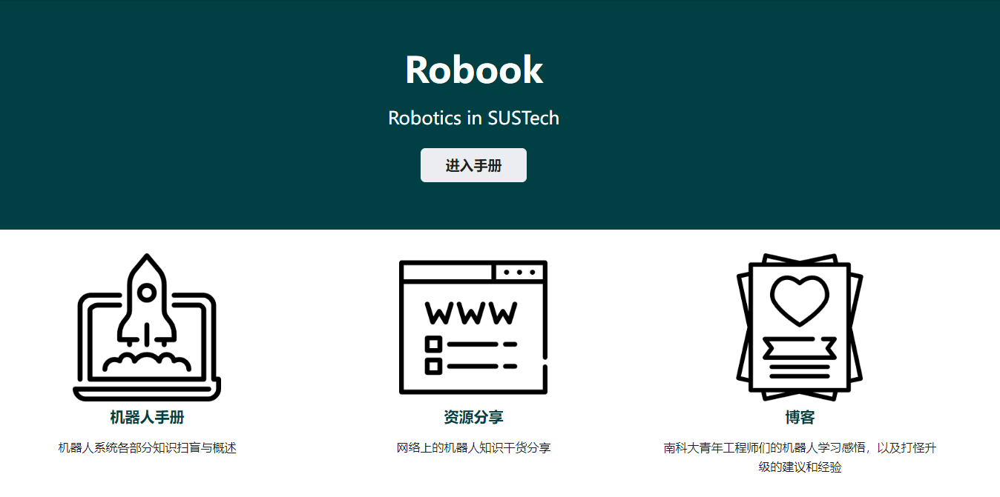

#  Robook

## Introduction

This repository is for [Robook](https://robook.org).

### Robook 是什么

**Robook是面向刚刚接触机器人领域或者对机器人领域感兴趣但尚不了解人群的一份入门手册。**

在南科大，对于刚刚刚刚接触机器人领域的学生，心中往往充满了疑问和憧憬：
- 什么是机器人？
- 机器人领域在做什么？
- 在南科大学习机器人什么样的资源和机会？
- 我想象中的机器人领域和真实的机器人领域差距有多大？
- 我想做的研究、我想解决的问题是否属于机器人领域的研究方向？
- 做机器人相关研究和工作需要学习什么？
- ...

Robook希望能够汇总有经验的人群对这些初入门者有益的资料，帮助大家快速了解机器人领域。

希望RoBook可以填补同学们从对机器人系统一无所知到对系统各部分有概念性的理解，以及知道如何在南科大找到属于自己的机器人升级之路。

目前Robook包含以下几大部分：
- 机器人手册： 机器人领域中各细分领域的研究内容介绍。
- 资源分享： 校园中、网络上关于做机器人的有效资源，包括但不限于社团、就业、升学、网络文章、领域资讯。
- 博客： 南科大学生或其他机器人领域从业者对机器人领域的个人感受。

### 为什么建立Robook

**如果兴趣带领你走到机器人领域的大门前，我们不想"信息壁垒"成为阻止你进入的障碍。**

Robook由南方科技大学两位机器人工程专业本科生牵头建立：戴存玺（2019级），魏锦启（2018级）.

正如前文所说，包括建立者在内的许多学生都在初入机器人领域时充满了疑惑，在我们有了一定经验之后，我们希望有这样一个平台，它可以集中这一领域的概况，便于大家快速了解相关背景，快速寻找到自己感兴趣的、有不解的方向。

每一个愿意为RoBook贡献内容的同学都有着类似的想法，大家带着这份善意和对南科大机械系越办越好的期待，为RoBook留下自己的经验。

### Robook在做什么

**学习、共享**

我们相信最值得借鉴的建议就是同样走过这条路的前人的建议，因此我们向20级-16级数十位有经验的机器人工程专业毕业生/在读生发出了征稿邀约，将在Robook首次上线时发布。

### 期待

**我们期待每一位热爱机器人领域的同志的加入。**

## Build

This website is built using [Docusaurus 2](https://docusaurus.io/), a modern static website generator.

### Deployment & Testing

- Clone this repository into your local environment, build the website by `npm` with command `npm run build`. Generated static files in "./build".
- Use `npm run serve` command to test your build locally.

## TODO List

- [x] GitHub Actions 自动发布
- [ ] 内容lint
- [x] 实验室介绍与分享
- [x] Netlify部署，境内外流量分流，加速大陆地区访问.
- [x] 支持PWA应用，离线使用
- [ ] 投稿奖励: 徽章
- [x] 图床
- [x] 离线内容搜索
- [x] 论坛： https://forum.robook.org

## 内容投稿

我们鼓励任何感兴趣的人成为Robook的内容贡献者.

要在手册中加入任何你想投稿的内容只需要以下几步：

0. 准备好包含有你要投稿内容的文件夹，其中含有投稿内容的`.md`文件以及用到的媒体素材，如果是纯文本则只需要`.md`文件,文件夹中**请不要包含子文件夹**.
0. Clone/Fork 仓库至你的开发环境，从 `master` 分支新建分支添加你要提交的内容. **分支请命名为此分支的主要改动**（例如`feature/github_actions`），并以`feature/`、`add/`、`fix/`开头分别表示新的特性、纯内容的添加和错误更正或bug修复.
0. 修改完成后**rebase至`master`最新状态并仅保留关键的commit信息**，提出Pull Request, 维护成员会在检查后merge至主分支并自动发布.

如果你是纯粹的内容贡献者,只需要准备上述的`0.`内容，将压缩包邮件(changshanshi@outlook.com)我们即可.

受限于维护成员的时间，提交的内容会在**数个非工作日**之中尽快完成.

除了自发的投稿者，我们同时不定期地积极寻找潜在的投稿者和有价值的信息来源，我们也欢迎学生、实验室提供有关的信息。对实验室、和个人的图文采访内容也纳入后续的规划之中，如有约稿意向也请联系我们.

## 技术支持

Docusaurus是基于React的文档构建框架，如有熟悉网站开发相关技术的朋友，对网站架构本身有指导也欢迎在GitHub上提交内容，或者直接联系并加入我们.

## 其它支持

Robook同时接受其他各种形式的支持，包括且不限于服务器、CDN、投稿者稿酬赞助、视频文字宣传等.
