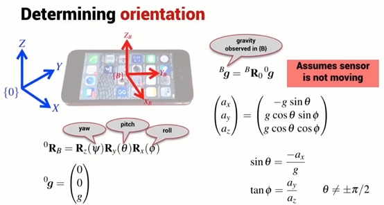
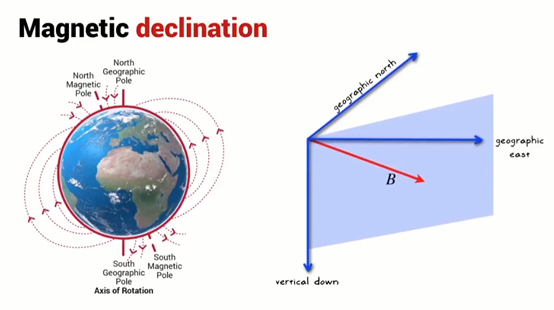
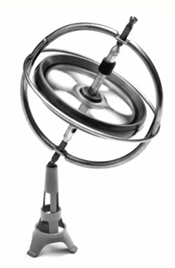
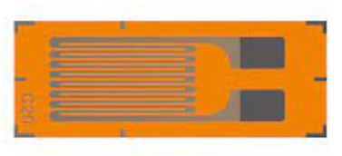
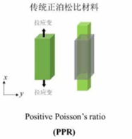
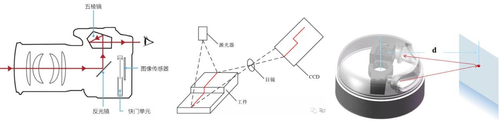
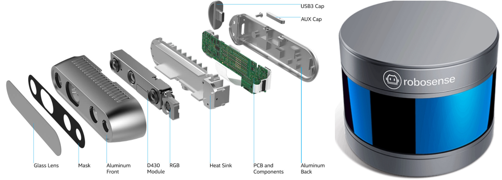
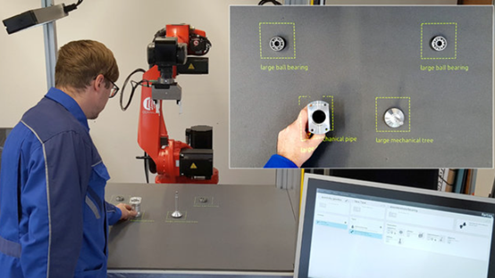
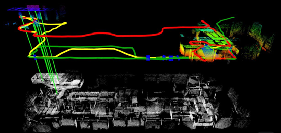
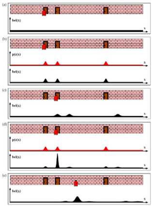

感知是机器人中非常重要的一环，根据人们所公认的机器人的定义：机器人能感知（percept）环境，从而做出决策（make decisions），然后做出相关反应（reaction）。感知是机器人与物理世界交互的入口。
<!--truncate-->

信息的获取来自于传感器，但感知并不局限于传感器，原始的信息获取后的处理算法也可以归类到感知范畴内。感知也不是与机器人的其他功能孤立开的，相反，感知会依赖于机器人做出的决策和采取的行为，也会影响他们。最为明显的一个例子是同步定位与建图，后文会提到。

传感器本身根据定义，就是将一段信号转化为另一段信号。这样的定义比较抽象，因为让我们举如下的例子帮助理解：

电流传感器。这种传感器一个典型的使用场合是伺服电机的控制器：当电机的使用者，比如机器人想电机保持恒定的电流时，便将电流指令发给电机控制器。电机控制器本身通过动态调整电机的电压以保持恒定电流。这时就需要电流传感器来反馈告诉电机控制器真实的电流值，以控制电压，这在控制的章节会详细的讲到。

> 左图为无人机飞控的库仑计，使用分压电阻测量电流；中图为互感式霍尔电流传感器，钳式电流表也是这样的原理；右图为霍尔电压电流传感器。

因此电流传感器就将电流信号转换成电机控制器可以理解的信号。如果这个电机控制器是微型计算机控制的，电流信号就应该是用二进制数字依照特定的规则表示的数据，例如10位（10bit）/10A，0表示没有电流，511表示5A电流，1023表示10A电流。这些数字的具体含义会在后面做出解释。在这里，具体的说，电流传感器把电流信号转换成了10位的数字信号。当然，电流传感器也可以把电流信号转换成电压信号。我们没有说电流传感器是具体怎么把电流信号转化成数字信号的，但是我们可以说说怎么把电流信号转换成电压信号，再进一步转换成数字信号。两种常见的电流信号转换成电压信号的方式是：1）当电流流过一个电阻时，电阻两端会产生电压差，对这个电压差采样，便得到了电压信号。这里的采样，可以理解成使用一个电压表，电压表分别接在电阻的两端。

> 分压电流传感器的原理图。R1为负载（未知），R2为采样电阻（已知），阻值比负载小非常多，R1 R2串联。当电流流过时，R2两端会产生分压。通过测量分压，然后除以R2电阻值即可得到电流值。

2）当电流流过一个导体时，如果导体在磁场中，电子会受到霍尔效应的影响，在导体与电流方向和磁场方向都垂直的方向——你可以想象一个立方体有六个面，电流方向是某两个面，磁场方向是另外两个面，那么剩下的两个面的方向便和电流、磁场方向都垂直了，在这个方向上，也会形成一个电压差，对这个电压差采样，便得到了电压信号。

> 霍尔电流传感器的原理图。当存在Z方向磁场时，当电流沿X方向流过金属导体，电子收到洛伦兹力偏转，在Y方向行程电势差。当电流稳定后，电势差也会稳定。对于电流电压传感器，是在恒定磁场中，通入电流，测量V_H（H即Hall Effect的缩写）来测量电流。而互感传感器是利用电流的磁效应来测量导线内磁场来反推电流的，因此不需要将传感器接入电路。（补充：为什么钳表可以分开再闭合？因为钳表的环其实是磁路（Magnetic Circuit），将磁场导到安装传感器的位置，相关的传感器并不需要一个闭环，磁路可以有气隙（Air Gap）。）

接着我们说说怎么把电压信号转换成上述的10位的数字信号。首先，微型计算机，或者说目前主流的计算机，都是数字计算机（digital computer），这里的数字，是相对于模拟（analogy）而言的。所谓的模拟就是，信号是连续的，具有无穷的分辨率——任何两个不相同的电压，你总是可以比较（分辨）出大小来，无论他们多么接近。但是两个很接近的电压，在数字信号表现出来，有可能是相同的——无论数字信号采用何种编码形式，只要他的编码长度是固定的，总可以找到两个不同的电压，使他们的编码是一样的。笔者在这里暗搓搓地使用了数学上的伊普西隆-德尔塔极限；）也就是说，电流传感器将电流信号转换成电压信号，常识上，我们都知道这些是模拟量——笔者并不想讨论量子力学的那一套，比如普朗克时间等等，我们机器人学与经典物理学更加亲近，因此显然时间也是模拟量。但是，数字计算机是无法处理模拟量的。即使是有限数量的数字量，也是越少越好——最少（好）的自然就是二进制。但是二进制仅能表示两个状态，未了表示更多的状态，我们需要更多的二进制位，这就是上述的10位的来源。读者们或许发现，0代表0A，1023代表10A，正好有2^10=1024个不同的“刻度“，这便是10位的意思。显然，这10位正好对应于十进制数码的二进制表示，而这个转换一般由模数转换器（Digital Analog Converter, DAC）实现，其中一种的实现方式是依赖于若干电压比较器和减法器。

> 上图：电压比较器。这里使用了一个运算放大器（Op Amp）和若干电阻。运算放大器有特别的性质和原理（理想情况下，放大倍率无限，且具有虚短、虚断的性质），可以制作各种模拟电路。在这里，当输入电压低于或高于比较电压时，会输出两个不同但各自相同的电压。下图：减法器的原理图。注意它和电压比较器的微小区别。输出电压为输入电压V2-V1.（加法器怎么实现？多并联几个V2，然后把V1接地（也就是0），即可。）

我们以5V为最大电压，0V为最小电压为例，试着实现一个2位ADC。首先我们会比较电压与2.5V的大小，如果大，则将电压减去2.5V并将第一位置1，否则不减并将第一位置0。然后继续比较电压与1.25V的关系，对第二位采取相同的操作——是的，然后你就会发现，如果电压在0V-1.25V，则输出是00（BIN，BIN是二进制的意思），如果电压在1.25V-2.5V，则输出是01（BIN），如果电压在2.5V-3.75V，则输出是10（BIN），如果电压在3.75V-5V，则输出是11.而这四个二进制数字刚好对应10进制的0，1，2，3.如果这个ADC是10位的，不难发现，它便会有前文所期望的效果。但实际上的DAC并不是使用这样的原理，而是使用了逻辑门代替减法器，逻辑门只需要电容和电阻就可以实现，成本比运算放大器低很多。类似的原理可以实现数模转换器（DAC），使用加法器实现，而这里便不展开。

> 上图：DAC原理图的一种。中图：ADC原理图的一种。值得注意的是，这里先用运算放大器将电压转换成八进制信号，然后再用逻辑门转换成二进制信号。

我们列举一些常见的机器人上使用的传感器，简单说明其原理和应用场景。
温度传感器：这无疑是非常重要的一种传感器。温度在很多时候就是需要控制的量；对于机器人来说，温度对于机器人电机非常关键。常用的温度测定方式有1）热敏电阻，也就是一种会根据温度改变电阻率的合金。2）热电偶，利用热电偶效应（Seebeck Effect）产生电压差。3）红外测温：前两种毫无疑问需要接触待测量的物体，而红外测温利用了物体辐射红外线的原理，无需接触待测量的物体即可测温。著名的黑体辐射普朗公式如下：

> 左图：热敏电阻的实物图。NTC是Negative Temperature Coefficient，意为随温度升高，阻值降低（实际上呈指数关系减少）。类似的还有PTC电阻，也就是温度越高，阻值越大。一般高级的加热器会使用PTC电阻，因为其本身会自动达到稳定的温度而不会有温度过高的风险。右图：热敏电阻放在电路的中原理图。这里可以取Ra为NTC温敏电阻，Rb为定值电阻，输出电压会随温度升高而升高（注意未必是线性关系）。

> 左图：热电偶的实物图。热电偶温度计可以接触测量各种气体、液体，且耐数百度甚至千度高温。右图：其电路原理图。A B为两种不同金属，当T1与T2存在温度差时，便会产生电压差V。

> 上图：光谱图。其中红光以右，波长大于780nm的一部分光为红外光。中图：详细的红外光谱图。下图左：测温相机的原理图。实际上和相机很相似。下图右：黑体辐射光谱图。实际上温度时根据物体辐射的光波长决定的。

编码器：这是机器人电机系统中最重要的传感器。编码器可以直接告诉电机控制器电机转子的位置，从而获得其速度。编码器有绝对位置和相对位置的区别，具体来说，绝对位置便是任何时刻都可以检测到转子的位置，而相对位置只能检测到转子自从上一时刻转过的角度。编码器的实现也有很多方式：1）电位器，这种实现多见于廉价的舵机，利用电位器可以改变电阻的特性来获取绝对位置。2）光栅编码器，转子连接打孔光栅板，通过光线传感器和计数器检测相对位置或绝对位置。3）磁编码器，转子连接磁铁，通过检测磁场变换获取相对位置或者绝对位置。

> 左：电位器的实物图。中：原理图。右：在舵机中的拆解图

> 左：光栅编码器的实物图。中：原理图。右：在电机中的拆解图。

> 左：磁编码器的实物图。值得注意的是，你无法仅从外观区分编码器类型。实际上，大多数情况下，满足要求的光编和磁编可以相互替换。中：原理图。右：在电机中的拆解图。

惯性测量单元（Inertia Measuement Unit, IMU）：这是欠驱动机器人几乎必须安装的传感器，与前文提到的电流、温度、编码器不同，这是一种称之为内感的传感器：可以这么理解，人有五感，但实际上这五感都是外感，实际上人还有两个内感：平衡感和本体感。

平衡感对应着类似于IMU的功能——你即使被蒙起眼睛来，你也能分辨你是否头朝下、脚朝上。当然，如果没被蒙起眼睛来，视觉也会帮助你辨别这一点，在后面的章节我们会继续将这个例子：）本体感更加神奇，笔者认为就好像是人的关节内部装了编码器一样——具体来说，本体感就是，当你闭上眼睛后，你依然可以准确的用左手摸到右耳。

> 对于一个机械臂而言，它不需要外部的传感器，只需要每个关节的编码器，就可以知道自身处于什么构型。这里是一个平面3自由度机械臂的例子，知道角度q1 q2 q3后，便可以知道末端的位姿。

回到IMU，IMU虽然叫做惯性测量单元，但是一般其测量的是自身的姿态（orientation）——例如飞机在空中的姿态。一些IMU还可以提供被测量物体的速度，包括线速度和速度。IMU测量姿态主要是结合和两种方式，一是类似于重力垂线的方式，可以获得姿态的一部分；另外是类似于指南针的地磁场传感器，可以获得姿态的另外一部分。

> 上图：重力方向测量原理，以及Roll Pitch解算原理。下图：磁场测量原理（指南针）。

结合这两种不同的测量，便可以得到姿态。为了测量速度，往往是测量加速度然后积分得到。加速度的测量方式则是牛顿第三定理——即一个已知质量的物体在加速时，须受到正比于加速度的合外力。测量到合外力之后，便可以获知加速度。值得注意的是，在没有地球重力场、或没有地球磁场的地方，上述测量时不成立的，只能使用陀螺仪。

> 陀螺仪（加速度计）

力/扭矩传感器（force/toque sensor），或者应变片（strain gauge）。这两者是不同的传感器，但是力/扭矩传感器往往是使用应变片实现的。应变片是测量材料微小形变的薄片电阻，将其粘贴在待测材料表面即可。

> 应变片的实物图。注意中间的金属细丝。当发送形变时，其尺寸会发生变化，因此电阻值也会发生变化。

当材料发生形变时，应变片电阻值也随之改变。其具体的原理是，应变片发生形变时，内部的金属也会随之发生形变——具体来说，在一定范围内，是横截面减小，长度变长，而其比值与材料的泊松比有关。

> 材料力学中泊松比的示意图。当材料被拉长后，其会变细，这符合一般直觉（当然也有反直觉的负泊松比材料）。泊松比时一定范围内材料拉长的长度与变细的长度的比例，是一个固定值。

而横截面与长度也影响导体的电阻，因此可以获得形变程度与电阻变化的关系。力传感器/扭矩传感器，就是利用已知材料在不同的外力/扭矩的作用下，通过型变量反推处力/扭矩的大小。

（RGBD）相机（camera）/激光雷达（Lidar = Laser Radar）。这两者也是不同的传感器，但是往往都被用在地图构建、物体识别等领域。普通的相机通过输出RGB（red green blue）三种颜色的信号输出彩色的视觉信号，而RGBD相机会多出Depth信息，也就是每个像素点到相机的距离信息。激光雷达可以获得某一平面上所有点到激光雷达的距离，而一些多线激光雷达，则可以获得整个空间中若干点到激光雷达的距离。

> 相机成像原理的图，结构光的原理图，激光雷达的原理图

> 常见RGBD相机和单线和多线激光雷达的实物图

而除了传感器本身之外，往往与传感器相关的算法也是感知的一部分。从某种意义上，这也是从一种信号转换成另外一种信号，但是往往是由数字计算机完成的。例如，相机获得的原始数据往往是无法被机器人理解与运用的，但是如果对这些数据流执行物体识别算法，就可以获得期望物体的坐标，而这里的物体识别算法就是传感器数据处理的一部分。举一个更加具体的例子来说，例如机械臂夹取桌子上的木块，而机械臂并不知道物块本身在哪里。但机械臂安装了RGBD计算机，因此首先可以用物体识别算法获知木块在图像上的位置，然后使用深度相机获得物块相对于相机的位置。毫无疑问，从相机的视频流信号到木块的位置信号的转换，整个也都算作是感知的过程。

> 机器人通过视觉传感器检测物体位置。

正如我们之前所说，感知、决策与执行是相互关联、相遇影响的，而我们将举出感知最为著名的例子：机器人同步定位与建图（Simultaneous Localization And Mapping, SLAM）。这个例子是基于这样的前提提出的：假设一个机器人被绑架了（The Kidnapped Robot），她/他并不知道自己在哪里。这个机器人应该如何找到回家的路？更加详细的说，这个机器人处于未知的环境中，她/他应该怎么探索这个未知的环境？于是定位和建图的需求就被提出来了：机器人并不知道自己在环境中的什么位置，所以需要使用激光雷达、相机来确定自己的位置，并且一定程度上获得当前自己周围的地图。但往往有一些被障碍物遮挡的位置，或者是超出相机/激光雷达的物体，机器人需要走到其他地方去进一步探索这些位置。于是，根据传感器获得的信息，会反馈作用到机器人的决策和运动控制上，而机器人位置发生了改变也会反过来影响传感器信息的获取。

> 机器人SLAM建图。

在我们刚刚提到的例子中，机器人的运动可以由相机/激光雷达、IMU和编码器获得，而我们将如何融合这些数据呢？这里我们并不详细展开，其中一种方式是：每个传感器给出自己对数据的可信程度，然后机器人本身根据自己历史上的运动数据推测出自己将来大致的情况，然后在根据这些数据和可信程度融合成一个最为可信的数据。而呼应前文提到的人的感知：在一些科技馆或者游乐园，会有那种让人产生错觉的设施——人走进一个旋转的罐子内部固定的桥上，管子上有引人注目的花纹，因此人的视觉会推测自身其实在一个旋转的环境中。但是，其实人是站在固定不动的桥上的，而这被人的“IMU“，耳蜗，准确的获取了。于是人就遇到了耳蜗告诉大脑其实人是静止的，而眼睛告诉大脑人在随着管子移动，而这种冲突人脑并不能很好的处理，使大多数人产生了眩晕的感觉。

> 机器人如何确定自己在哪里？

> 你何如确定自己在动还是静止？
