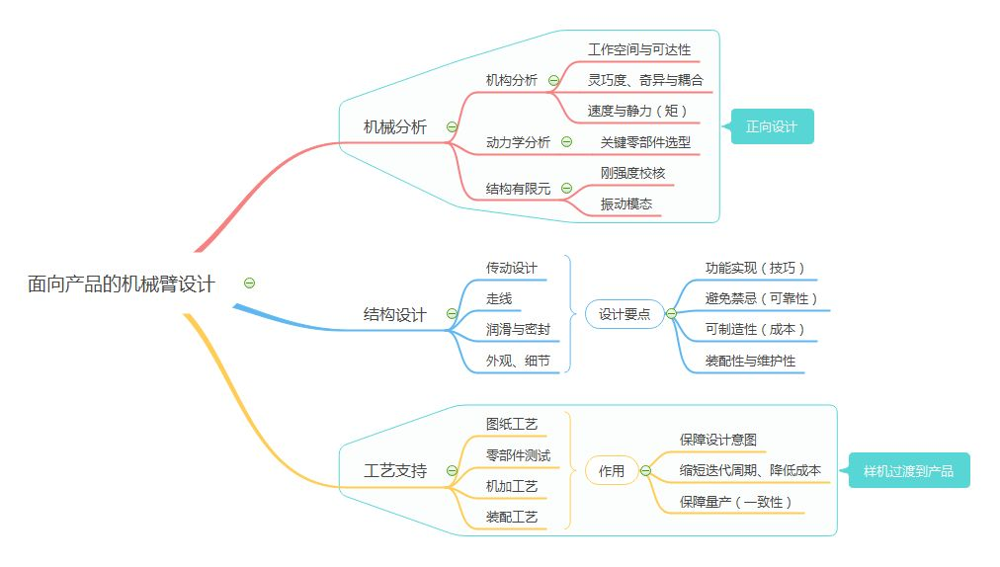

受到邀请写作这个话题，其实非常煎熬，因为机械是一个很庞大的学科，即使是机器人中的机械也可以有很多说的，况且自己也不是一个纯机械科班学生，只是更多的会喜欢做也做得更多机械相关的工作，如果要把“机械”这个话题写成类似于知乎[@YY硕](https://www.zhihu.com/people/yyss2037)的[机器人工程师学习计划](https://zhuanlan.zhihu.com/p/22266788)那样的学习计划我是做不到的。只能写一写我的理解和学习建议。

<!--truncate-->

本文内容主要在这几个方面：
1. 机械在机器人工程专业中充当着什么样的角色？对于这个问题谈谈我的理解。 
2. 怎么样学习机械和练习提升自己的机械能力？这部分我会结合自己的一些经历来讲述 
3. 一些其他参考文章、博客 

## 机械在机器人工程专业中充当着什么样的角色？

首先，机器人是一个非常综合的学科，造一个机器人会需要涉及到包括机械在内的各方面知识，那么机械在机器人中是一个怎么样的角色呢？这里化用@来朝三博士的话——重要但不核心

>在现实中，很多人习惯按照抽象程度将各种技术从核心到非核心进行排序。机械恰好两样都不占，自然排不上核心技术。我并不完全排斥这种排序。不过，我一直固持这么一个看法：机器人包含多种技术，其中任何一个单项拎出来都不是可以轻松突破的。缺了任何一个单项，都做不成机器人。因此，任何一个单项的工作对于开发机器人来说都同等重要。机械部分是机器人的执行机构，对于机器人的重要性，好比身体对于人的重要性。所以说，其中的重要性你可以细品。

“机械是机器人的执行机构，对于机器人的重要性，好比身体对于人的重要性”，所以机械是重要的，不是核心的问题在于，目前工业界和学术界的各种机器人，于软件（算法、控制）上的限制，是要比硬件（机械、电子）的限制大的。也就是说，在软件上进行突破后取得的效果，是比硬件大的。

那么是不是意味着我们学习机器人工程专业，可以不怎么关心机械，甚至不学机械呢？我认为是不行的。

如果不是做例如纯CS/EE方向的不跟机器人本体或者不需要机器人本体的机器人学科，例如AI，深度学习、图像传感、智能驾驶、无人导航等，除此之外，需要跟机器人本体打交道的机器人方向，每个机器人工程的学生都应该多多少少会点机械，起码会用SolidWorks或者Fusion360等CAD软件画点简单的图，会用3D打印，会拧螺丝，这样在跟机器人本体打交道的时候不至于机器人出了一点点机械硬件问题不能快速解决。

我实验室有一个做SLAM的同学，每天几乎就是看论文，做SLAM实验和处理数据，再加写代码改算法优化程序。看起来是不是跟机械关系很小？但是他们做实验用的小车上面需要搭载各种传感器和处理器，而小车本身是不自带，也不带接口的，就需要去做一点点机械设计（非常简单的设计），他如果要找实验室其他人（比如我）帮他做设计，很可能大家都没有时间，或者打乱人家的科研节奏。所以他是自己用SolidWorks去画碳纤维板的结构，再发出去加工，两三天就做好了。

如果能够在此基础上知道一些机电相关的知识，如驱动器、传感器、减速器等，那么更全面的认识可以帮助我们在机器人开发上省下不少时间（比如选择合适的驱动器）。

如果想要在机械方面有更深入的认识和能力提升，可以看一看我下面的一些拙见。在此之前，再提一句，那么，完整的“机械”在机器人上是怎么样的角色呢？这里还是引用@来朝三博士的文章[1]

> 由于结构设计工作比较直观，很多人误以为机械臂的设计就是结构设计。实际上，面向产品的机械臂设计远不只结构设计这么简单，还包括机械分析和工艺支持。

机械臂是这样的，其他自由度高的四足、双足机器人也是如此，区别在于，非产品级的机器人设计不需要像产品级机械臂这样面面俱到。我们看下图，机器人的机械设计分为“机械分析”、“结构设计”和“工艺支持”三个部分，每个部分需要涉及的知识和技能都不少，所以我们可以发现，会一点机械的人很多，会完整“全栈”机械的人很少。在科研实验室里面做机器人，这三个部分不需要特别深入，但也需要有一定的了解和运用。

## 怎么样学习机械和练习提升自己的机械能力？

机械这门课学科比较零散，不容易系统学习，我也没有经过系统的训练，属于是个半吊子选手，不过对于机器人工程学科，作为一个机器人工程师，并不需要像机械工程专业的学生那样面面俱到，每个知识都学的很深入。大体可以有这样一个原则（其实对于机器人学习的其他方面也适用）——遇到了什么问题，就去学什么知识和技能，而且只focus on这一个关键topic，不去多学暂时没有用的。不过在此之前，需要建立一个big picture或者有一定基础，才能够让我们在遇到新的问题的时候知道如何去学习和解决问题，比如遇到的一个问题是以前涉及到的一个知识点的延伸，这样可以快速的学习和解决问题。至于如何提升机械能力，作为工程学科，提升能力最好的方式就是多看别人的设计以及自己上手实践。所以这部分主要分为

0. 机械的理论知识学习可以怎么去学 
0. 有哪些优秀的案例可以参考 
0. 可以如何去实践 
0. CAD建模的一些Tips 

## 理论知识

理论知识，也就是需要上一些必要的课程，我这里以南科大科的的课程设置为例（等我快写完的时候我看新的2022级培养方案，发现好多课程或者课程名字设置都不一样了，暂且先用我那个时候的名字吧）

0. CAD与工程制图 
0. 制造工程认知实践 
0. 机械设计基础 
0. 理论力学和材料力学 

这些课程也恰好都是南科大机器人工程培养方案的必修课程，所以我觉得咱们的培养方案还是很合理的。

### CAD与工程制图

这门课是咱们机械系各专业甚至很多工科专业的必修课，其重要性不必多说。上完这门课，可以直接从一个不懂机械的小白，变成一个能看懂工程图，会画基本工程图，和会用CAD完成基本的3D建模的机械小白。如果这门课的project能找到几个志趣相同的队友，一起做一个稍微复杂的机械装置类的project，会对你的建模能力有很大帮助。也就有能力去实验室“打工”了。

### 制造工程认知实践

这门课在传统高校叫做“金工实习”，课程内容除了实践类的数车数铣和磨锤子，还有这些加工技术的理论知识（了解程度）。这门课最有趣也最能提升机械认知的过程就是在数车、数铣，和用PPCNC等实践时。学完这门课，对机械的制造认知有很多帮助。

在用铣床车床的过程中，可以让你切身体会到机械CNC加工是怎样运作的，在以后在设计机械零部件的时候，自己的设计可以怎么样去配合CNC加工，这样可以从设计的时候就避免了加工中会出现的问题（比如，设计了一个槽，但是这个槽的位置是深埋的，导致CNC加工的刀头无法正常切槽铣削）。

这门课更进一步是先进制造实践，内容在制造工程认知实践上面加深了，也会有实践，不过我没有上过。除此之外还有纯理论的机械制造基础。如果没有时间其实可以不必深入。

### 机械设计基础

这门课如其名 ，是教你如何标准地去做机械设计，包括传动、连接零部件的设计，以及常用工作参数下的通用零件的设计，包括基本设计理论和方法以及技术资料、标准的应用等。

这门课比起之前几门课都会更枯燥更难一些，不过也请大家好好上 :)

机械设计中很多设计都是需要计算的，比如两个零部件的链接方式如果是使用螺纹紧固件链接，需要计算紧固件强度是否满足，虽然大多数时候我们都可以根据别人的设计，总结别人的经验来选择我们需要的紧固件设计，但是我们还是应该要知道其计算方式，需要用到的时候（比如设计出来后连接强度不够）不至于毫无头绪

这门课教的传动零件知识，比如轴、联轴器、键、销、V带传动、蜗轮蜗杆、齿轮齿条、在机器人的设计上都是比较重要的知识，不一定要熟记于心，但是需要有所印象，对其熟悉。如果将来要涉及到多自由度机器人的设计，这些知识将会频繁用到。

另外，学完这门课也应该会尝试着看《机械设计手册》和其他大型标准件五金制造商比如MISUMI米思米的机械手册了，帮助你在设计机器人的时候中对标准件（比如轴承、齿轮、皮带等）进行选型。

### 理论力学和材料力学

机械设计基础是对于分开零部件、或者运动零部件的设计，相反的，这两门课特别是材料力学针对的是单个零部件、不动的零部件的设计校验。不过说来惭愧，我的材料力学这门课学的比较差，就记住了一些常用的高桥度结构（比如工字梁），在以后的设计中使用上。虽然对于机器人工程学生来说，在机器人本体设计上，不是特别需要用纸和笔去校验每一个部位的强度，通常这个工作可以用CAD软件的力学仿真功能代替，但是我们需要知道其原理（知其所以然），不然在做力学仿真的时候，需要填的参数都不明白。

## 优秀的参考

除了看机械设计手册和MISUMI米思米等制造商的手册，我们还可以多看看一些UP主/YouTuber/公众号/网站，去学习他们优秀的设计与其中的机械原理，我这里汇总了不少我会看的：

- 机械设计类、3D打印类、机械拆解类、建模技巧分享类的UP主/YouTuber/公众号，学习他们的设计思路，仿照他们的优秀设计与机械原理 
  - Ben哥3D研究所：https://space.bilibili.com/363883069/
  - 小白的3DP乐园：https://space.bilibili.com/415209268/
  - 麦克斯的修复领域：https://space.bilibili.com/306979414
  - 阿偉制造：https://space.bilibili.com/50132752/
  - 404小设：https://space.bilibili.com/285706426/
  - 林果儿linguoer：https://space.bilibili.com/1069577466/
  - 黑人黑科技：https://space.bilibili.com/14368720/
  - Owen来造：https://space.bilibili.com/1363795039/
  - 极物技：https://space.bilibili.com/365355167/
  - solidworks魔方云学院：https://space.bilibili.com/31958155/
  - 睡不醒的艾尔文：https://space.bilibili.com/629972870/
  - K总宅在家：https://space.bilibili.com/3104478/
  - SolidWorks大魔王：https://space.bilibili.com/493661479/
  - Melonshu：https://space.bilibili.com/678073/
  - 汇影科普：https://space.bilibili.com/1152816605
  - SWEDU：https://space.bilibili.com/596425120/
  - Ultimaker官方：https://space.bilibili.com/508148610/
  - 设计推演：https://space.bilibili.com/381996440/
  - 永恒跳动的火焰：https://space.bilibili.com/373039846/
  - 机械图纸狗_聂同学L：https://space.bilibili.com/323945391/
  - 硬核拆解：https://space.bilibili.com/427494870/
  - 稚晖君：https://space.bilibili.com/20259914/
  - 帆雨动画：https://space.bilibili.com/22084320/
  - 极客匠：https://space.bilibili.com/129259501/
  - 方猫boom：https://space.bilibili.com/138624168/
  - Maker's Muse: https://www.youtube.com/c/MakersMuse 
  - How To Mechatronics: https://www.youtube.com/c/HowToMechatronics 
  - CAD CAM TUTORIAL: https://www.youtube.com/c/CADCAMTUTORIAL 
  - WildRoseBuilds: https://www.youtube.com/c/WildRoseBuilds 
  - Mechanistic: https://www.youtube.com/user/dannysltang 
  - Fusion 360 School: https://www.youtube.com/c/Fusion360School 
  - GoEngineer: https://www.youtube.com/c/goengineer 
  - plusAlpha Designs: https://www.youtube.com/channel/UCYA3Vr-8D2DFgt7JeqX6WMA 
  - MISUMI: https://www.youtube.com/c/MISUMI-US 
  - Jared Owen: https://www.youtube.com/c/JaredOwen 
  - Lars Christensen: https://www.youtube.com/user/cadcamstuff 
  - SolidWorks Tutorial: https://www.youtube.com/c/Sw-tcNet 
  - CNC Kitchen: https://www.youtube.com/c/CNCKitchen 
- 免费CAD模型获取 
  - GrabCAD，各种CAD模型都有，体量比较大：https://grabcad.com/library 
  - TraceParts，成百上千家供应商零件的CAD模型： https://www.traceparts.com/ 
  - PartCommunity，跟TraceParts类似，除了供应商的零件外，还有许多手册、标准的PDF库：https://b2b.partcommunity.com/community/ 
  - Thingiverse，汇集了全世界各DIY爱好者分享的3D模型（偏向3D打印），https://www.thingiverse.com/ 
  - 微信公众号“SolidWorks研习社”，每天会分享不同模型与一些建模技巧 
  - 上面都是免费可以获取的资源，如果舍得花钱，还有“沐风网”可以看看 

## 实践

作为工程学科，实践是最能提升工程能力的操作。如果你已经进实验室了，那么跟着实验室的某个项目进行机械设计的实践是最好不过了。

如果自己或者实验室有一台3D打印机，那么可以多多自己做一些设计，用3D打印来快速练手（实验室用的话要跟实验室商量好）。另外，机械设计出来的零件，用3D打印和CNC加工出来的效果是完全不同，差别很大的，在用不同加工工艺进行设计的时候需要多加注意，这也是实践的重要部分。

比如我以前在CMU做Intern的时候，要为一个零部件设计螺纹，这个零部件不需要很好的力学性能，仅仅作为电子零件的连接件，那么就完全不需要用金属CNC加工，可是，如果是3D打印，该如何设计比较好的螺纹出来呢？虽然工业界有现成十分成熟的解决方案（heat inset热镶嵌螺母），但是当时我还是做了一些文献资料查阅，针对不同方法进行比较，还写了一个总结报告。这个过程也是十分重要的工程能力提升过程，我把我的总结报告也附在这里。

[How to Design the Thread in 3D Printed Plastic](./How%20to%20Design%20the%20Thread%20in%203D%20Printed%20Plastic.pdf)

另外，在这个阶段，除了多看（优秀的案例），还要多问，如果是为实验室设计机器人的零部件，设计好了以后最好能够问一问实验室经验更丰富的师兄师姐或师弟师妹（笑），让他们帮你看一下设计是否有缺陷，特别是要发出去CNC加工的零件，否则设计成本很高。

## CAD建模Tips

首先对于CAD建模的软件使用上，大多数学生都是用的SolidWorks，因为我们学校CAD课程教学使用的软件是这个，对于使用SolidWorks建模，我有一些建议，以前当CAD课程的学生助教的时候给同学们分享过，我把PPT附在下面。

[Tips for Solidworks Design](./Tips%20for%20SolidWorks%20Desgin.pdf)

另外，如果有机会，我比较推荐使用另一个类似的CAD软件，叫做Fusion 360，是AutoDesk公司（做AutoCAD的公司）。Fusion 360对比SolidWorks，有大部分相同的功能，但是他更简洁，也不会让使用者成为正版软件的受害者，主要优点在于

- 联网使用，教育免费，不用使用破解版软件 
- 云端存储，不同设备上同步进度 
- 云端协同操作，多位建模者可以成为一个team进行建模，进度同步 
- 界面简单，学习成本低，学习速度快 
- UI好看，建模出来的模型默认display效果比SolidWorks好 
- 建模逻辑导致更高效的工程建模。Fusion 360的一个文件是一整个工程，以机械臂为例，在Fusion 360里面会直接包括所有的零部件（各个机械臂的link和joint、驱动器等），而SolidWorks的每一个零部件一般都是单个文件，然后组成装配体文件（当然SolidWorks也可以像Fusion 360一样在一个装配体文件做所有零件的操作，不方便） 
- 不用担心不同版本不适配，没有2018，2019之说 

当然也有一些缺点，在于

- 对网络有一些要求，由于服务器在海外，每次登陆会比较久 
- 建模自由度不如SolidWorks，很多Feature很难直接生成（SolidWorks里面就会直接或间接有对应的生成方式） 
- 动画制作自由度不如SolidWorks高 
- 仿真能力不如SolidWorks强 

最后我还比较建议把建模软件的语言都改成英文，这样在遇到问题要去Google或者YouTube搜索的时候，不至于不懂别人在说什么。

## 参考文章

0.  机器人本体机械工程师是种怎样的体验？ - 来朝三博士的文章 - 知乎 
https://zhuanlan.zhihu.com/p/430306384
0. 没有任何机械基础，如何自学机械设计？ - 风云雷电的回答 - 知乎 
https://www.zhihu.com/question/20244140/answer/70597135
0. 没有任何机械基础，如何自学机械设计？ - 知乎 
https://www.zhihu.com/question/20244140/answer/25200784
0. 没有任何机械基础，如何自学机械设计？ - 胡秋实的回答 - 知乎 
https://www.zhihu.com/question/20244140/answer/14464088